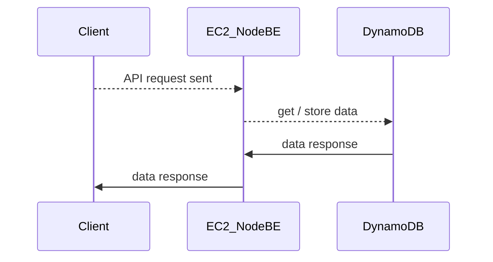
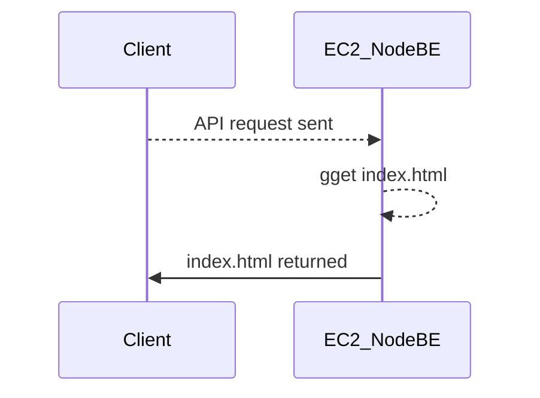

## App overview

This is a slide show app do display slides written in html markup. App built with React backend is served by a Node / Express application.

## Running version

Deployed to http://3.86.89.70/

## Getting started

To get started with this app, you need to have **Node.js** and **npm** installed. Follow the steps below to set up the app locally.

### Clone Repoository

```bash
git clone https://github.com/socal/emp_test.git
```

### FrontEnd

FrontEnd code is in `./FE` folder

```bash
cd ./FE
npm i
npm run dev
```

#### Components

1. `App` - renders 2 subcomponents, and sets up context for state management
   1. `NavBar` - renders buttons on top of the page for CRUD actions and navigation between pages
   2. `MainContainer` - renders 2 subcomponents
      1. `SideBar` - renders the `Tile` componenets.
         1. `Tile` - displays minified version of html. By clickin on this element we can navigate throught the tiles.
      2. `Content`- dispays the full size version of the markup. Hosts editor when app is in `isEdit` mode.

#### State management

State properties are injected at the top level, can be obtained in any component though `AppContext`.

1. `isEdit` - edit mode, can be triggered by clicking on `Edit` / `Save` buttons
2. `data` - slide html data
3. `selected` - current slide index

#### Future considerations

1. Better sanitized html
2. Editor improvements
3. User login / logout
4. Multiple slide set availability

#### NOTES:

1. application is hard coded to get the first slide set for user 2. BE part is written with expendable data model in mind.
2. for local development, ie when vite dev server is running, have a BE instance running on `localhost:3001` or change settings in `App.jsx`

### BackEnd

BackEnd code is located in the `./BE` folder

```bash
cd ./BE
npm install
npm start
```

This will spin up your local service on `PORT: 3001`

### Docker instance

There is also a Dockerized version available. Running the following bash script would spin up a docker instance on port 80 (exposed from container)

```bash
 sh ./dockerBuild.sh
```

### BackEnd architecture

#### API calls



#### index.html load


